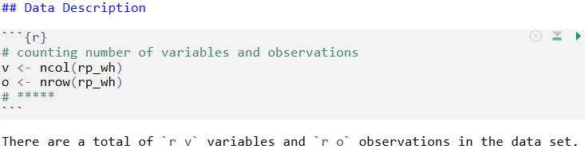

```{r setup, include=FALSE}
knitr::opts_chunk$set(echo = TRUE, warning = FALSE, message = FALSE)
```

```{r installPackages, echo=FALSE}
# install the required packages
install.packages("tidyverse")
install.packages("knitr")
install.packages("dplyr")
# *****
```

```{r loadLibraries, echo=FALSE}
# load the required libraries
library(tidyverse, quietly = T)
library(knitr, quietly = T)
library(readr, quietly = T)
library(dplyr, quietly = T)
# *****
```

## Research Question

Do workers in richer countries work longer hours?

## Data Introduction

***Description***

-The data set (Feenstra et al., 2015) has details on the average annual working hours of a worker, real gross domestic product, people employed and population of various countries from the year 1950 to 2019. [Working Hours](https://www.rug.nl/ggdc/productivity/pwt/)

-Since the raw data set was too large, the filter() function was used to get the data for 2019.

-The select() function was used to obtain the variables relevant to the required analysis.

-The rename() was used to rename some of the variables from the raw data set to make it easier for the audience to understand.

-The mutate() function was used to create a new variable gdp_capita

-The arrange() function was then used to arrange the filtered data in descending order to figure out some of the countries with the highest GDP Per Capita (most prosperous) and with one of the lowest GDP Per Capita (least prosperous). 

-Then the filter() function was used on the raw data set again to obtain the information on the shortlisted countries so that it may be explored further to answer the research question.

***Variables***

The variables that may be used to investigate the research question are:

-country, which shows the name for each country

-year, which indicates the year

-rgdpo, which is the output-side real GDP to compare relative productive capacity across countries and over time

-avh, which is the average sum of hours worked by employees and self-employed people during each year in a country.

-pop, which is the population of each country

-emp, which is the number of people employed

-to help answer the question, two new variables have been mutated, namely gdp_capita, which gives an idea of the prosperity of a particular country and created further on in the report is productivity, which is the output in USD per hour worked.

```{r readData and review, echo=FALSE}
# Read data and review
wh <- read.csv("Data/pwt1001.csv")
# *****
```

**Table to show variable names**
```{r}
# wrangling data
wh_mod <- filter(wh, year == 2019) %>% select(country, year, rgdpo, pop, emp, avh) %>% rename(gdp = rgdpo, population = pop, people_employed = emp, hours_per_year = avh) %>% mutate(gdp_capita = gdp/population)

wh_mod2 <- arrange(wh_mod, desc(gdp_capita))

rp_wh <- filter(wh, country %in% c("Cambodia", "Bangladesh", "Pakistan", "Luxembourg", "Switzerland", "Norway")) %>% select(country, year, rgdpo, pop, emp, avh) %>% rename(gdp = rgdpo, population = pop, people_employed = emp, hours_per_year = avh) %>% mutate(gdp_capita = gdp/population)


table_wh <- head(rp_wh, 5)

knitr::kable(table_wh)
# *****
```

## Data Description

**Number of variables and observations**

```{r}
# counting number of variables and observations
v <- ncol(rp_wh)
o <- nrow(rp_wh)
# *****
```

There are a total of `r v` variables and `r o` observations in the data set.

**Display the figure**

```{r out.width='100%'}

```

**Types of variables**

```{r}
# show first two rows of the data and the types of variables
str(head(rp_wh,2))
# *****
```

## Data Summary

```{r}
# data summary
summary <- rp_wh %>% group_by(country) %>% summarise(mean_gdp_capita = mean(gdp_capita, na.rm=TRUE), gdp_capita_sum = sum(gdp_capita, na.rm=TRUE), mean_hours_worked = mean(hours_per_year, na.rm=TRUE), hours_worked_sum = sum(hours_per_year, na.rm = TRUE))

knitr::kable(summary, caption = "An analysis of GDP Per Capita and average annual hours worked for some of the most prosperous and least prosperous countries (1950-2019)")
# *****
```

-The mean GDP Per Capita suggests that Switzerland and Luxembourg are some of the most prosperous nations

-Cambodia and Bangladesh are some of the least prosperous nations

-However, the mean hours worked suggests that a worker in Switzerland and Luxembourg actually works the least average number of hours annually as compared to the other countries. 

Therefore, it may be concluded that workers in **richer** countries do not work longer hours as compared to workers in less prosperous nations.

-The sum for both GDP per Capita and hours worked does not provide an accurate insight into either the comparison of the average earning of a worker over the time period mentioned or the comparison of the average total hours worked over the same time period because of the missing values in the data set.

**Table to show Productivity**

```{r}
#filter the data to create the productivity table
dp <- filter(rp_wh, year == 2019)

# create table to show productivity
rp_p <- dp %>% mutate(productivity = gdp/(hours_per_year*people_employed))

knitr::kable(rp_p, caption = "An analysis of productivity of some of the most prosperous and least prosperous countries (2019)")
# *****
```

-It may be reconfirmed from the table that both Switzerland and Luxembourg with productivity of almost USD 83 per hour and USD 80 per hour respectively, are some of the most prosperous nations in the world

-However, with productivity of only USD 3 per hour and USD 5 per hour respectively, it may be reiterated that Cambodia and Bangladesh are some of the least prosperous nations

-It can also be seen that a worker in the more productive nations Switzerland and Luxembourg, works for approximately 1556 and 1505 hours annually respectively, which is significantly lower than the average annual hours worked by a worker in Cambodia and Bangladesh

-Therefore, the table suggests that workers in more productive economies do not work longer hours

## Visualisations

**Variation of average annual hours worked with GDP Per Capita**

```{r}
#scatter plot of average annual hours worked vs GDP Per Capita
sp <- ggplot(data = dp, aes(x = gdp_capita, y = hours_per_year, colour = country)) +
  geom_point() + labs(title = "Variation of average annual hours worked with GDP Per Capita",x = "GDP Per Capita (USD)",y = "Average annual hours worked",subtitle = "The average annual hours worked decrease as GDP Per Captia increases.", caption = "Based on 2019 data") + theme_bw() + theme(legend.title = element_blank())

sp
# *****
```

- *Switzerland and Luxembourg have the highest GDP Per Capita but the lowest average annual hours worked, whereas, Cambodia and Bangladesh have the lowest GDP Per Capita but the highest average annual hours worked*
- *The average annual hours worked decrease with a rise in GDP Per Capita*

**Variation of average annual hours worked with productivity**

```{r}
#scatter plot of average annual hours worked vs productivity
sp2 <- ggplot(data = rp_p, aes(x = productivity, y = hours_per_year, colour = country)) +
  geom_point() + labs(title = "Variation of average annual hours worked with Productivity",x = "Productivity (USD/hr)",y = "Average annual hours worked",subtitle = "Workers in more productive economies work less hours", caption = "Based on 2019 data") + theme_bw() + theme(legend.title = element_blank())

sp2
# *****
```

- *Switzerland and Luxembourg are among countries with the highest productivity and the lowest average annual hours worked, whereas, Cambodia and Bangladesh are among countries with the lowest productivity and the highest average annual hours worked*
- *The average annual hours worked decrease with a rise in productivity*

## Conclusions

-The average annual income of a person in Switzerland is approximately USD 75000, which is almost twenty times more than that of a person in Cambodia, which is approximately USD 4500

-However, the data analysis and scatter plot suggest that a worker in Switzerland worked for 1556 hours in 2019 as compared to the worker in Cambodia who worked for 2475 hours in the same year.

-The worker in Switzerland worked 919 hours less annually.

-The analysis of productivity indicates that Switzerland has more than twenty five times the productivity of Cambodia, however, a worker in Switzerland works approximately 37% less than a worker in Cambodia

-It is found that the average annual hours worked are significantly less in countries with higher GDP Per Capita

-Furthermore, the average annual hours worked are far less in more productive economies

-Therefore, all of the above mentioned insights acquired may be used to make the informed conclusion that economic prosperity varies significantly among countries and workers in richer countries do not work longer hours.

## References

Feenstra, Robert C., Robert Inklaar and Marcel P. Timmer (2015), "The Next Generation of the Penn World Table" American Economic Review, 105(10), 3150-3182,(Version 10.01)[Data Set]. available for download at www.ggdc.net/pwt

## Data

```{r}
# add data to the data folder
write.csv(wh, file = 'Data/pwt1001.csv')
# *****
```
